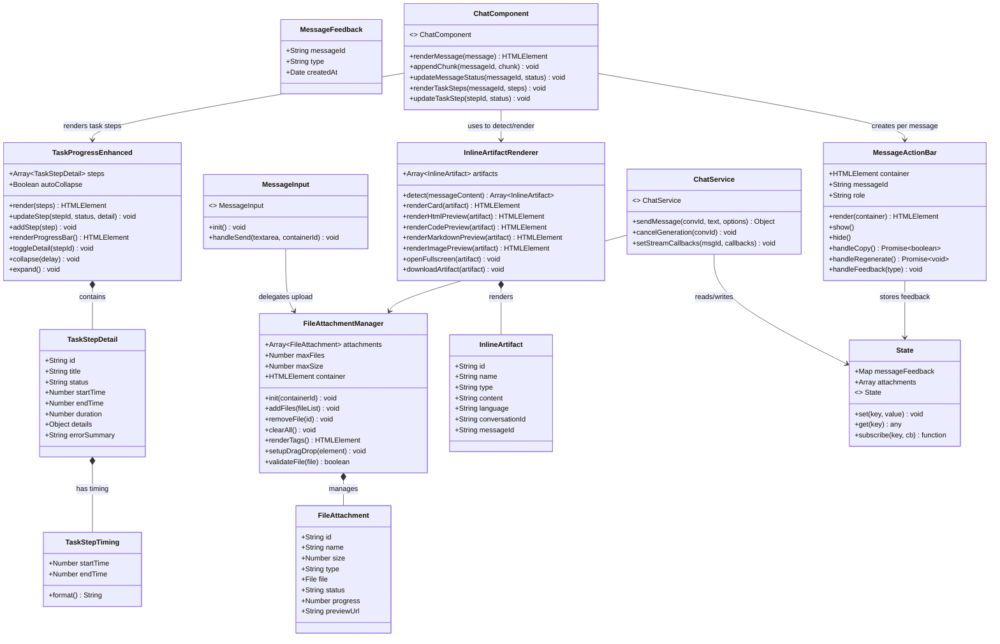
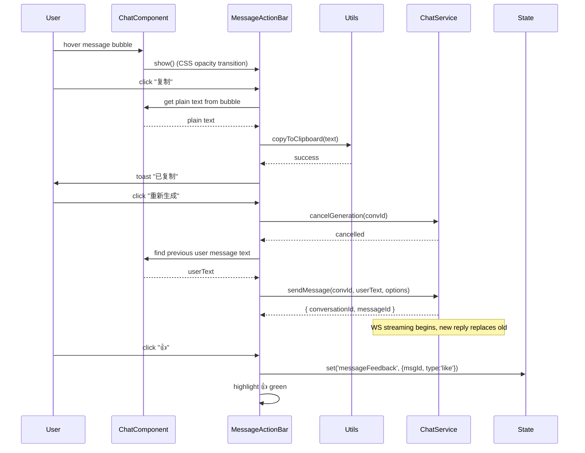
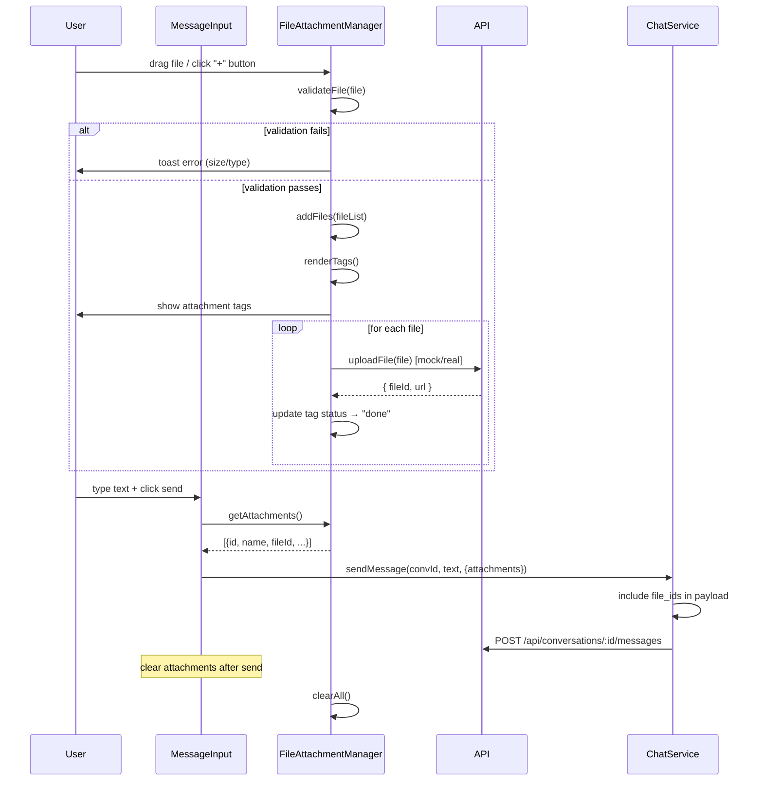
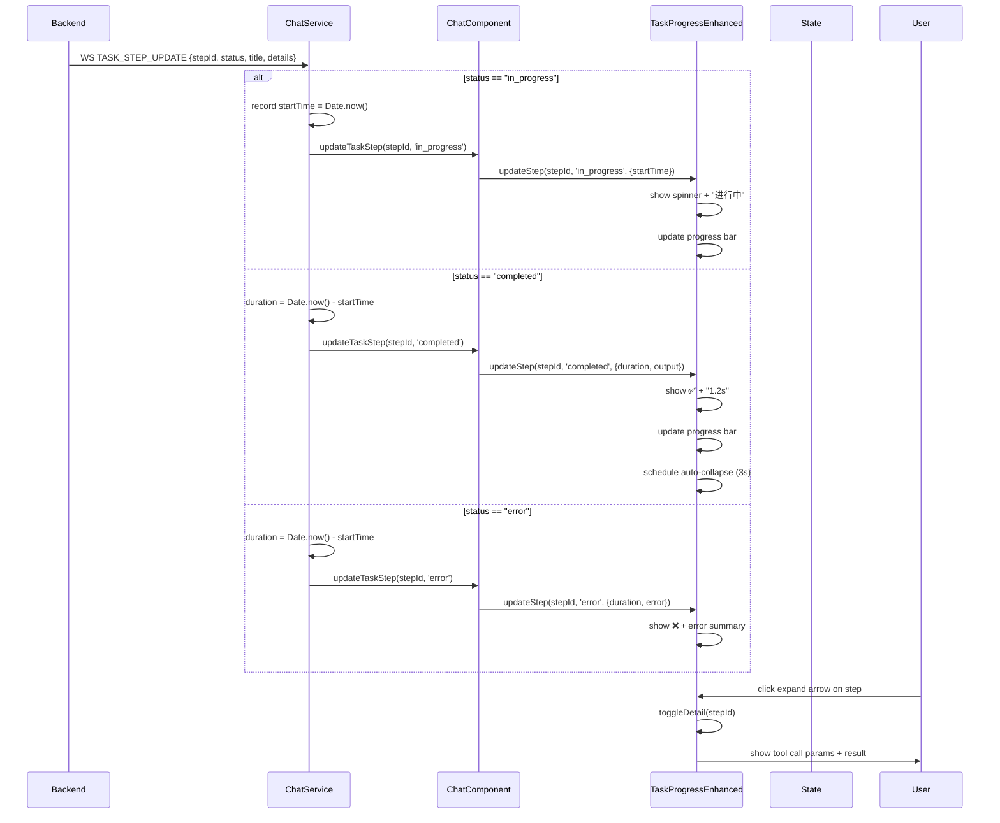
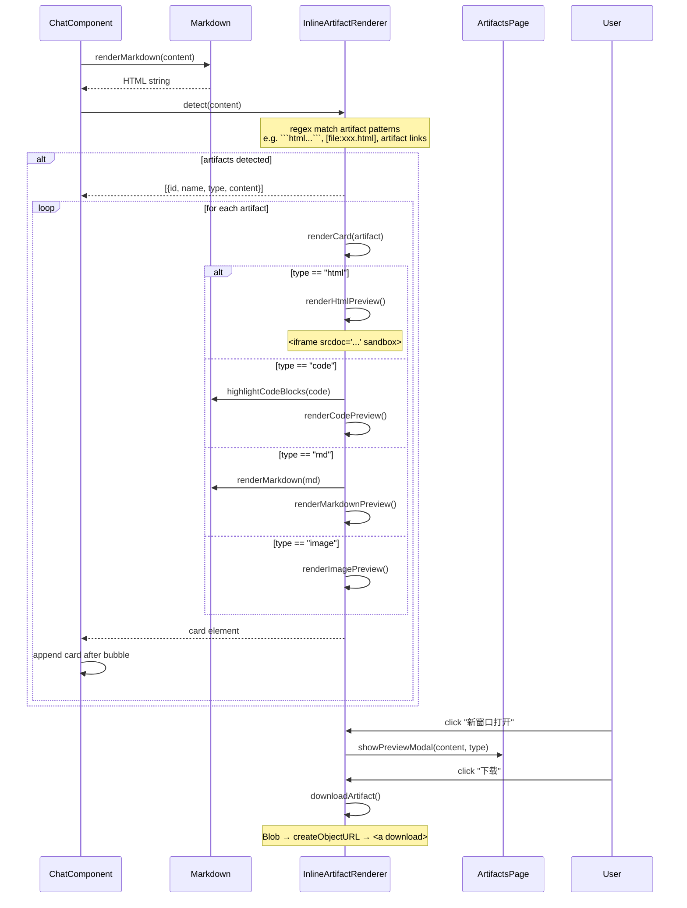
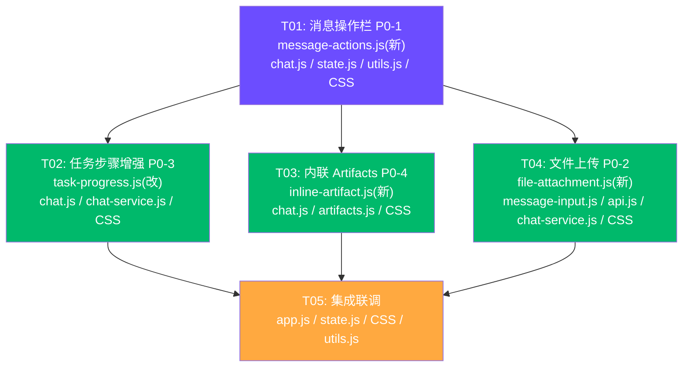

# Agent Studio Desktop — P0 功能系统架构 v2

> **设计者**: 高见远（Gao）· 架构师
> **日期**: 2025-06-20
> **范围**: P0-1 消息操作栏 / P0-3 任务步骤增强 / P0-4 内联 Artifacts / P0-2 文件上传

---

## Part A: 系统设计

---

### 1. 实现方案

#### 1.1 总体策略

四个 P0 需求全部为**纯前端实现**。遵循现有架构模式：**State(观察者) → Service(API/WS) → Component**。每个新功能创建独立组件模块，通过修改现有组件（chat.js、message-input.js、task-progress.js）进行集成。

```
现有架构层级（不变）：
┌─────────────────────────────────────────────────┐
│  app.js (入口, 初始化, 全局事件绑定)              │
├─────────────────────────────────────────────────┤
│  Components (UI 层, 10→14 个组件)                │
│  chat.js / task-progress.js / message-input.js  │
│  artifacts.js / tool-call.js / sidebar.js ...   │
│  + message-actions.js (新)                       │
│  + file-attachment.js (新)                       │
│  + inline-artifact.js (新)                       │
├─────────────────────────────────────────────────┤
│  Services (业务编排层)                            │
│  chat-service.js (send/cancel/stream管理)        │
├─────────────────────────────────────────────────┤
│  Infrastructure                                  │
│  state.js / api.js / websocket.js / utils.js    │
│  markdown.js (marked + DOMPurify + hljs)        │
└─────────────────────────────────────────────────┘
```

#### 1.2 P0-1: 消息操作栏

**核心挑战**: 在现有 `renderMessage()` 的静态渲染流程中注入交互式操作栏，同时保持消息气泡结构与流式更新兼容。

**实现方案**:
- 新建 `message-actions.js` 组件，独立管理操作栏 DOM 和交互逻辑
- 修改 `chat.js` 的 `renderMessage()`——在 AI 消息气泡下方插入操作栏容器
- 操作栏通过 CSS `opacity/visibility` 实现 hover 渐显效果，无需 JS hover 事件
- **复制**: 复用 `utils.js` 的 `copyToClipboard()`——提取消息纯文本（剥离 markdown 标记）
- **重新生成**: 调用 `chatService.cancelGeneration()` + 找到前一条 user 消息的原始文本，调用 `chatService.sendMessage()` 重发
- **点赞/点踩**: 存储在 `state._data.messageFeedback` Map 中（key: messageId），UI 即时反馈
- **编辑**（额外）: 用户消息 hover 显示编辑按钮，点击将气泡替换为 textarea，Enter 提交编辑后的消息重新发送

**技术选型**: 纯 DOM 操作，无需额外框架。

#### 1.3 P0-3: 任务步骤可视化增强

**核心挑战**: 在现有简洁的 `task-progress.js` 基础上增加耗时统计、进度条、展开详情，且不影响现有流式更新逻辑。

**实现方案**:
- 扩展 `task-progress.js`：
  - 每个 step 增加 `startTime`/`endTime`/`duration`/`details` 字段
  - 新增进度条子组件（纯 CSS 实现，读取 completed/total 比例）
  - 新增步骤详情面板（手风琴展开，显示工具调用参数和结果）
- 修改 `chat.js` 的 `renderTaskSteps()` 和 `updateTaskStep()`：传递增强后的 step 数据
- `chat-service.js` 的 `onTaskStep` 回调中记录时间戳：
  - `in_progress` → 记录 `startTime = Date.now()`
  - `completed`/`error` → 计算 `duration = Date.now() - startTime`
- 完成/失败后自动折叠（3 秒延迟），可手动展开/折叠

**技术选型**: 纯 DOM + CSS transition，利用现有 `STEP_ICONS` 体系扩展。

#### 1.4 P0-4: 对话内 Artifacts 内联预览

**核心挑战**: 在消息流中检测 artifact 内容并内联渲染预览卡片，与已有的 artifacts 独立页面不冲突。

**实现方案**:
- 新建 `inline-artifact.js` 组件：
  - `detectArtifacts(markdownContent)` — 检测消息中的 artifact 引用（`[artifact:xxx]` 语法或文件链接模式）
  - `renderCard(artifact)` — 渲染预览卡片
    - HTML → `<iframe srcdoc="..." sandbox="allow-scripts">`（350px 高，可拖拽调整）
    - Code → 复用 `markdown.js` 的 highlight.js 进行语法高亮
    - Markdown → 复用 `renderMarkdown()`
    - Image → `` 自适应缩略图，点击放大
  - 卡片右上角：新窗口打开 + 下载按钮
- 修改 `chat.js` 的 `renderMessage()`：渲染 AI 消息后，调用 `detectArtifacts()` 并在气泡下方插入预览卡片
- 复用 `artifacts.js` 的 `getArtifactType()` 类型检测逻辑和 `showPreviewModal()` 全屏预览逻辑
- artifact 数据来源：
  - **方案 A（推荐）**: 复用现有 `artifacts.js` 中从 `api.getArtifacts()` 加载的数据，按 `conversation_id` 过滤
  - **方案 B**: 后端通过 WS 推送 `artifact_created` 事件（需确认后端支持）

**技术选型**: 复用 marked + DOMPurify + highlight.js 现有栈

#### 1.5 P0-2: 文件上传/附件

**核心挑战**: 前端需要构造拖拽区域、FormData 上传、附件预览标签，后端上传端点当前不存在（需 mock）。

**实现方案**:
- 新建 `file-attachment.js` 组件：
  - 管理附件列表状态（add/remove/clear）
  - 渲染附件标签行（文件名 + 大小 + 类型图标 + 删除按钮）
  - 拖拽区域管理（dragenter/dragover/dragleave/drop 事件）
- 修改 `message-input.js`：
  - 在输入区域上方注入附件标签容器
  - 绑定"+"按钮打开文件选择器（`<input type="file" multiple>`）
  - 在发送消息时将附件文件列表传递给 `chatService.sendMessage()`
- 新增 `api.uploadFile(file)` 端点封装：
  - **当前**: mock 实现，前端本地暂存文件对象，返回 fake URL
  - **后续**: 接入 `POST /api/fs/upload` multipart/form-data
- 修改 `chat-service.js` 的 `sendMessage()`：增加 `attachments` 参数，在消息 payload 中附带 file_ids 或 base64 数据
- 文件约束：最多 10 个，单文件 ≤50MB，支持常见类型（pdf/docx/txt/png/jpg/csv/json/zip）

**技术选型**: 原生 File API + FormData，无需额外库。

---

### 2. 文件列表

```
src/
├── components/
│   ├── chat.js              # [修改] 集成消息操作栏 + 内联 Artifacts 检测
│   ├── task-progress.js     # [修改] 增强：进度条 + 耗时 + 展开详情
│   ├── message-input.js     # [修改] 文件上传入口 + 附件标签行
│   ├── artifacts.js         # [修改] 导出 getArtifactType() 供复用
│   ├── message-actions.js   # [新建] P0-1: 消息操作栏组件
│   ├── file-attachment.js   # [新建] P0-2: 文件附件管理组件
│   └── inline-artifact.js   # [新建] P0-4: 内联 Artifacts 预览卡片
├── services/
│   └── chat-service.js      # [修改] 增加 attachments 参数 + 反馈调用
├── api.js                   # [修改] 新增 uploadFile() + submitFeedback()
├── state.js                 # [修改] 新增 messageFeedback / attachments 状态
├── utils.js                 # [修改] 新增 extractPlainText() / formatDuration()
├── app.js                   # [修改] 初始化新组件
└── styles/
    └── components.css       # [修改] 新增操作栏/附件/进度条/内联卡片样式
```

**文件数量统计**: 新建 3 个文件，修改 9 个文件。

---

### 3. 数据结构与接口



---

### 4. 程序调用流程

#### 4.1 P0-1: 消息操作流程



#### 4.2 P0-2: 文件上传流程



#### 4.3 P0-3: 任务步骤增强流程



#### 4.4 P0-4: 内联 Artifacts 预览流程



---

### 5. 待澄清事项（Anything UNCLEAR）

| # | 问题 | 假设 |
|---|------|------|
| 1 | 点赞/点踩数据是否需要持久化到后端？ | **假设**: 先存本地 state（`messageFeedback` Map），后续接入 `POST /api/feedback` |
| 2 | 后端是否有 `POST /api/fs/upload` 端点？ | **假设**: 当前不存在，前端先实现 mock（本地 File 对象暂存），UI 完整，待后端接入后替换 mock |
| 3 | Artifact 在消息中如何被检测？后端是否推送 `artifact_created` WS 事件？ | **假设**: 前端通过正则匹配消息内容中的代码块（```html, ```js, ```css, ```md）和 artifact 引用链接来检测，不依赖新 WS 事件 |
| 4 | 重新生成时应保留历史还是替换？ | **假设**: 替换模式——重新发送上一条用户消息的原始文本，新 AI 回复替换当前回复 |
| 5 | 文件上传后 file_id 如何与消息关联？ | **假设**: 上传后获得 file_id → 在 `sendMessage` payload 中通过 `file_ids` 数组传递 |
| 6 | 任务步骤详情（工具调用参数/结果）数据来源？ | **假设**: 复用现有 WS `TASK_STEP_UPDATE` 事件的扩展字段（`details`），如后端暂无此字段则逐步增强 |

---

## Part B: 任务分解

---

### 6. 依赖包

本项目**无需新增依赖包**。P0 功能全部使用现有技术栈：

```
- dompurify@^3.0.0     (已有) — HTML 安全净化
- highlight.js@^11.9.0  (已有) — 代码语法高亮
- marked@^12.0.0        (已有) — Markdown 渲染
- vite@^5.0.0           (已有) — 构建工具
```

---

### 7. 任务列表

| 任务 ID | 任务名称 | 源文件 | 依赖 | 优先级 |
|---------|---------|--------|------|--------|
| **T01** | 消息操作栏（P0-1）+ 基础设施扩展 | `src/components/message-actions.js`（新）, `src/components/chat.js`（改）, `src/state.js`（改）, `src/styles/components.css`（改）, `src/utils.js`（改） | 无 | P0 |
| **T02** | 任务步骤可视化增强（P0-3） | `src/components/task-progress.js`（改）, `src/components/chat.js`（改）, `src/services/chat-service.js`（改）, `src/styles/components.css`（改） | T01 | P0 |
| **T03** | 对话内 Artifacts 内联预览（P0-4） | `src/components/inline-artifact.js`（新）, `src/components/chat.js`（改）, `src/components/artifacts.js`（改）, `src/styles/components.css`（改） | T01 | P0 |
| **T04** | 文件上传/附件（P0-2） | `src/components/file-attachment.js`（新）, `src/components/message-input.js`（改）, `src/api.js`（改）, `src/services/chat-service.js`（改）, `src/styles/components.css`（改） | T01 | P0 |
| **T05** | 集成联调与样式打磨 | `src/app.js`（改）, `src/state.js`（改）, `src/styles/components.css`（改）, `src/utils.js`（改） | T02, T03, T04 | P0 |

---

### 8. 共享知识（Shared Knowledge）

#### 8.1 通用约定

```
- 所有 API 响应使用 { success: boolean, data: any, error?: string } 格式
- 所有 WebSocket 事件名使用 snake_case（参考 ws-events.js）
- 组件间通信：State(观察者) → Component（不直接跨组件调用 DOM）
- 新组件导出方式：named export functions + default export object
- CSS 命名：BEM 风格前缀，如 .msg-actions__btn、.file-attachment__tag
- 所有用户可见文本使用中文
```

#### 8.2 状态键名约定

```
- messageFeedback: Map<messageId, { type: 'like'|'dislike', createdAt: ISO }>
- attachments: Array<FileAttachment>（当前输入区的附件列表）
- taskStepDetails: Map<stepId, { startTime, endTime, details, error }>
- inlineArtifacts: Map<messageId, Array<InlineArtifact>>
```

#### 8.3 消息格式约定

```
- user message: { id, role:'user', content: string, createdAt: ISO }
- assistant message: { id, role:'assistant', content: string, createdAt: ISO, 
    toolCalls: Array, taskSteps: Array, artifacts: Array }
- content 为 markdown 字符串
- toolCalls 和 taskSteps 按现有格式
```

#### 8.4 文件上传约定

```
- 当前阶段：前端 mock 上传，File 对象暂存于 FileAttachmentManager
- 后续接入：POST /api/fs/upload (multipart/form-data)
  → 响应: { file_id: string, url: string, name: string, size: number }
- 发送消息时 payload 增加: { file_ids: string[] }
- 单文件上限 50MB，单次最多 10 个文件
- 支持类型: pdf, docx, txt, csv, json, xml, png, jpg, gif, svg, zip
```

#### 8.5 Artifact 检测规则

```
- 检测模式（按优先级）：
  1. Markdown 代码块: ```html / ```js / ```css / ```md / ```py / ```rs / ```go
  2. 文件链接: [filename.ext](url) 模式
  3. Artifact 引用: [artifact:name](artifact://id) 模式（预留）
- 类型映射: ext → 'html'|'code'|'md'|'image'
- 内容截断: 代码超过 200 行时仅显示前 200 行 + "显示全部"按钮
```

#### 8.6 任务步骤计时约定

```
- startTime: step status 变为 'in_progress' 时的 Date.now()
- endTime: step status 变为 'completed'|'error' 时的 Date.now()
- duration: endTime - startTime (ms)
- 显示格式: < 1s → "0.8s", < 60s → "12.5s", ≥ 60s → "2m 15s"
- 未开始步骤不显示耗时
- in_progress 步骤显示实时计时（每秒更新）
```

---

### 9. 任务依赖图



**并行策略**: T02、T03、T04 仅依赖 T01（chat.js 基线），完成 T01 后三个任务可并行开发。T05 在所有功能完成后进行最终集成。

---

## 附录：详细实现指引

### A. T01 消息操作栏 — 详细说明

**新建文件 `src/components/message-actions.js`**:
```javascript
// 导出:
export function render(messageId, role, bubbleElement) → HTMLElement
export function setupHoverListeners(rowElement, actionsBar)
// 核心方法:
- buildActionBar(messageId, role) → HTMLElement
  - role==='assistant': [复制, 重新生成, 👍, 👎]
  - role==='user': [编辑, 复制]
- handleCopy(messageId) → 提取气泡纯文本 → copyToClipboard()
- handleRegenerate(messageId) → 找前一条 user 消息 → cancel + resend
- handleFeedback(messageId, type) → state.set('messageFeedback', ...)
```

**修改 `chat.js` — `renderMessage()`**:
- AI 消息气泡后调用 `messageActions.render(msgId, 'assistant', bubble)`
- 用户消息气泡后调用 `messageActions.render(msgId, 'user', bubble)`
- 将返回的 actions bar 插入 contentWrapper

**新增 state 键**:
- `messageFeedback`: `{}` （key: messageId, value: { type, createdAt }）

**新增 utils 函数**:
- `extractPlainText(htmlElement)` — 从消息气泡提取纯文本（去除 markdown 标记）

### B. T02 任务步骤增强 — 详细说明

**修改 `task-progress.js`**:
- `render(steps)` 增加:
  - 进度条：`renderProgressBar(completed, total)`
  - 展开详情按钮
- `renderStep(step)` 增加:
  - 耗时显示（`formatDuration(duration)`）
  - 展开箭头（若有 details）
  - 详情面板：`renderDetailPanel(step.details)`
- `updateStep(stepId, status, meta)` 扩展 meta 参数:
  - `{ title, startTime, endTime, duration, details, error }`
- 新增 `toggleDetail(stepId)` — 展开/折叠详情
- `collapse(delay)` — 自动折叠逻辑增强（仅折叠已完成的步骤面板）

**修改 `chat-service.js` — `onTaskStep` 回调**:
- 扩展回调参数：`{ stepId, status, title, details }`
- 内部维护 step timing Map

**修改 `chat.js`**:
- `renderTaskSteps()` 传递增强数据
- `updateTaskStep()` 接收完整 meta

### C. T03 内联 Artifacts — 详细说明

**新建文件 `src/components/inline-artifact.js`**:
```javascript
// 导出:
export function detect(content) → Array<InlineArtifact>
export function renderCard(artifact) → HTMLElement
export function renderHtmlPreview(content) → HTMLElement
export function renderCodePreview(code, language) → HTMLElement
// 核心方法:
- detect(content): 正则匹配代码块 + 文件链接
  模式1: /```(\w+)\s*\n([\s\S]*?)```/g 提取代码块
  模式2: /\[([^\]]+\.(\w+))\]\(([^)]+)\)/g 提取文件链接
- renderCard(artifact): 
  - 顶部栏: 文件名/类型图标 + [新窗口] [下载]
  - 中部: 预览区（iframe/code/markdown/image）
  - 底部: 可拖拽 resize handle
```

**修改 `chat.js` — `renderMessage()`**:
- AI 消息渲染后，调用 `inlineArtifact.detect(content)`
- 若检测到 artifact，调用 `inlineArtifact.renderCard()` 并插入 contentWrapper

**修改 `artifacts.js`**:
- 导出 `getArtifactType(filename)` 供 inline-artifact.js 复用
- 导出 `showPreviewModal(content, type)` 供全屏预览

### D. T04 文件上传 — 详细说明

**新建文件 `src/components/file-attachment.js`**:
```javascript
// 导出:
export function init(containerId)
export function addFiles(fileList)
export function removeFile(id)
export function getAttachments() → Array
export function clearAll()
export function setupDragDrop(element)
// 核心数据结构:
- _attachments: Array<{id, name, size, type, file, status, progress}>
// 核心方法:
- validateFile(file) → boolean (检查类型、大小)
- renderTags() → HTMLElement (附件标签行 DOM)
- uploadFile(file) → Promise (mock 或真实上传)
```

**修改 `message-input.js`**:
- `bindInputArea()` 中注入附件容器
- `handleSend()` 中读取 `fileAttachment.getAttachments()` 传给 chatService
- 绑定"+"按钮和文件输入

**修改 `api.js`**:
- 新增 `uploadFile(file)`:
  ```javascript
  // Mock 实现（当前阶段）
  export async function uploadFile(file) {
    return { file_id: genId(), name: file.name, size: file.size, url: '#' };
  }
  // 真实实现（后续接入）
  // const form = new FormData(); form.append('file', file);
  // return request('/api/fs/upload', { method:'POST', body: form, headers: {} });
  ```

**修改 `chat-service.js`**:
- `sendMessage()` 签名增加 `attachments` 参数
- payload 增加 `file_ids` 字段

### E. T05 集成联调 — 详细说明

**修改 `app.js`**:
- 导入新组件模块
- `init()` 中初始化 file-attachment.js（绑定输入区）
- 为全局函数增加新入口

**修改 `state.js`**:
- 确认所有新增 state key 初始化：`messageFeedback`, `attachments`, `taskStepDetails`, `inlineArtifacts`

**修改 `components.css`**:
- 最终视觉打磨（间距、动画、响应式适配）
- 确保新组件样式与现有设计语言一致（CSS 变量体系）

**修改 `utils.js`**:
- 新增 `extractPlainText()` — HTML → 纯文本
- 新增 `formatDuration(ms)` — 毫秒 → "1.2s" / "2m 15s"
