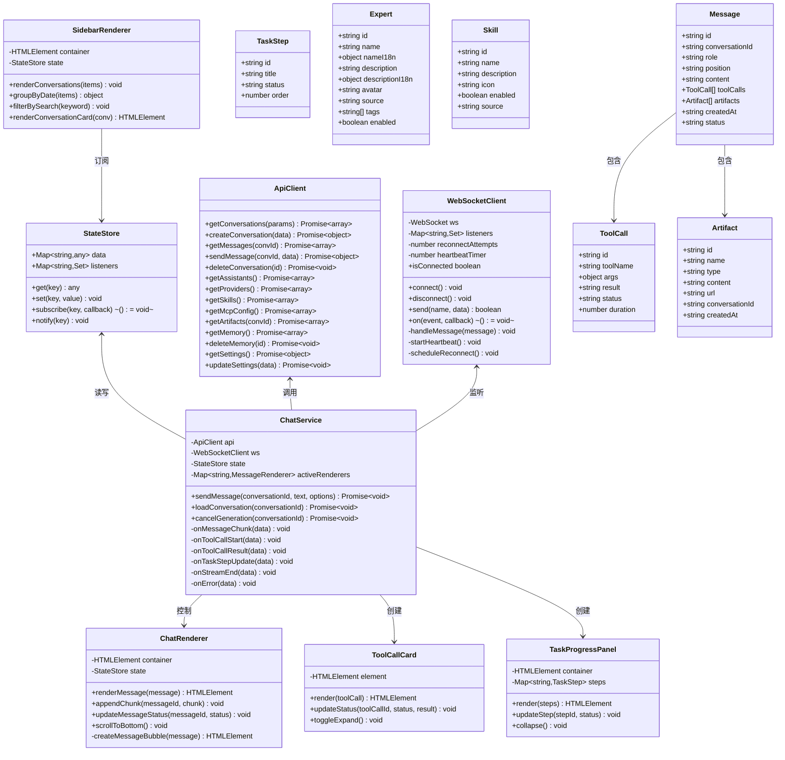
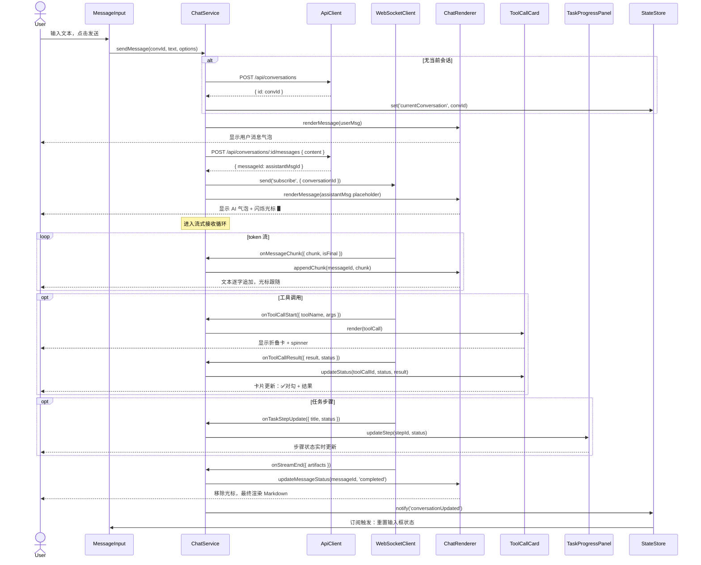
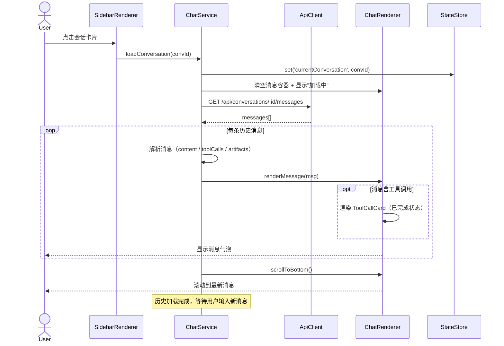
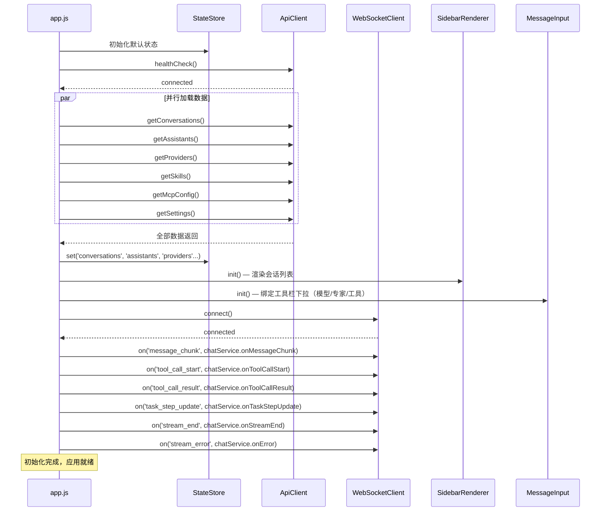
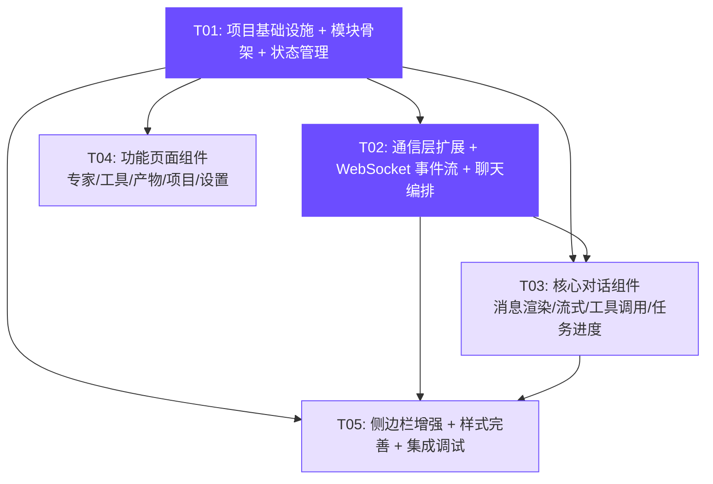

# Agent Studio Desktop — 系统架构设计文档

- **版本**：v1.0
- **日期**：2025-07-14
- **架构师**：高见远（Gao）
- **基于 PRD**：许清楚 v1.0
- **项目名称**：agent_studio_desktop
- **技术栈**：Tauri 2.x + Vite + 纯 HTML/CSS/JS（ES Modules）+ AionCore（Rust, HTTP REST + WebSocket）

---

## Part A：系统设计

### 1. 实现方案

#### 1.1 核心技术挑战

| # | 挑战 | 解决方案 |
|---|------|---------|
| C1 | **单文件巨石应用**：`index.html` 约 1387 行，HTML/CSS/JS 全部内联，`api.js` 和 `websocket.js` 虽存在但**未被实际引用**（inline JS 直接用 `fetch`） | 将 inline JS 提取为 ES Module 文件，通过 `<script type="module">` 引入；HTML 保留 DOM 结构和 CSS，JS 逻辑外迁 |
| C2 | **流式消息渲染**：WebSocket 已连接但未监听业务事件，发送消息后无法接收流式回复 | 在 `websocket.js` 中注册 `message_chunk`、`tool_call_*`、`task_step_update` 事件监听器，由 `chat-service.js` 编排消息生命周期 |
| C3 | **工具调用 + 任务进度可视化**：需要动态插入折叠卡片和步骤列表，并在流式过程中实时更新 | 设计 `ToolCallCard` 和 `TaskProgressPanel` 渲染函数，通过 DOM 引用（`element.dataset`）精确更新单个卡片状态 |
| C4 | **Markdown 渲染 + 代码高亮**：AI 回复含 Markdown 语法和代码块，当前仅纯文本展示 | 引入 `marked`（Markdown 解析）+ `highlight.js`（代码高亮），均为轻量 CDN/npm 库，无框架依赖 |
| C5 | **无框架状态管理**：纯 JS 需要管理当前会话、模型选择、专家选择、流式状态等全局状态 | 设计轻量 `StateStore` 模块（观察者模式），所有模块通过 `state.subscribe()` / `state.get()` 读写状态 |

#### 1.2 框架与库选型

| 库 | 版本 | 用途 | 选型理由 |
|----|------|------|---------|
| **marked** | ^12.0.0 | Markdown → HTML 解析 | 轻量（~30KB），无依赖，API 简单 `marked.parse(text)` |
| **highlight.js** | ^11.9.0 | 代码语法高亮 | 支持 190+ 语言，可按需引入语言包，CDN 友好 |
| **DOMPurify** | ^3.0.0 | XSS 防护（净化 marked 输出） | marked 默认不转义 HTML，需 DOMPurify 清洗 |
| **Vite** | ^5.0.0（已有） | 构建工具 | 已配置，无需更换 |

> **不引入前端框架**（React/Vue/Svelte），保持 PRD 约定的纯 HTML/CSS/JS 架构。模块化通过 ES Module `import/export` 实现。

#### 1.3 架构模式

采用 **模块化 MVC 变体**：

```
┌─────────────────────────────────────────────────────────┐
│                     index.html                          │
│  (DOM 结构 + CSS 样式，无业务 JS)                        │
├─────────────────────────────────────────────────────────┤
│  app.js (入口：初始化所有模块、绑定事件)                  │
├──────────┬──────────┬───────────┬───────────────────────┤
│  State   │ Services │ Components │   Utils              │
│ (状态层)  │ (服务层)  │ (视图层)   │  (工具层)            │
│          │          │           │                       │
│ state.js │ api.js   │ chat.js   │ utils.js             │
│          │ ws.js    │ sidebar.js│ markdown.js          │
│          │ chat-    │ experts.js│                      │
│          │ service  │ tools.js  │                      │
│          │ .js     │ artifacts │                      │
│          │          │ .js       │                      │
│          │          │ settings  │                      │
│          │          │ .js       │                      │
└──────────┴──────────┴───────────┴───────────────────────┘
```

**数据流**：
```
用户操作 → Component 调用 Service → Service 调用 API/WebSocket → 更新 State → Component 订阅 State 变化 → 重新渲染 DOM
```

---

### 2. 文件列表

#### 2.1 现有文件（需修改）

| 文件路径 | 修改内容 | 职责 |
|---------|---------|------|
| `src/index.html` | 移除全部 inline `<script>`；添加新 CSS 类（工具卡、任务面板、流式光标）；底部改为 `<script type="module" src="/src/app.js">` | DOM 结构 + CSS 样式 |
| `src/api.js` | 新增 `getSkills()`、`toggleSkill()`、`getArtifacts()`、`getMemory()`、`deleteMemory()` 等缺失端点 | REST API 封装 |
| `src/websocket.js` | 新增业务事件常量定义；保持连接/重连/心跳逻辑不变 | WebSocket 客户端 |
| `package.json` | 新增 `marked`、`highlight.js`、`dompurify` 依赖 | 依赖声明 |
| `vite.config.js` | 确保 `build.outDir` 指向 `dist`，配置 optimizeDeps | Vite 构建配置 |

#### 2.2 新建文件

| 文件路径 | 职责 |
|---------|------|
| `src/app.js` | **应用入口**：导入所有模块，执行初始化序列（连接检测 → 加载数据 → 绑定事件 → 启动 WebSocket） |
| `src/state.js` | **全局状态管理**：当前会话 ID、模型选择、专家选择、流式状态、会话列表缓存等；观察者模式 `subscribe/notify` |
| `src/utils.js` | **工具函数**：`escapeHtml`、`formatTime`、`debounce`、`groupConversationsByDate`、`copyToClipboard` 等 |
| `src/markdown.js` | **Markdown 渲染**：封装 `marked` + `highlight.js` + `DOMPurify`，导出 `renderMarkdown(text)` 函数 |
| `src/services/chat-service.js` | **聊天编排服务**：编排「发送消息 → 创建/获取会话 → REST 发送 → WebSocket 接收流式 → 管理工具调用/任务进度生命周期」 |
| `src/components/chat.js` | **对话视图组件**：渲染消息列表、流式光标动画、消息气泡（Markdown 渲染）、滚动管理 |
| `src/components/tool-call.js` | **工具调用组件**：折叠卡片渲染（工具名/入参 JSON/结果），状态图标（spinner/对勾/叉号） |
| `src/components/task-progress.js` | **任务进度组件**：步骤列表渲染，实时状态更新（pending/in_progress/completed），自动收起 |
| `src/components/message-input.js` | **消息输入组件**：输入框事件绑定、发送逻辑、工具栏联动（模型/专家/工具下拉接入真实数据） |
| `src/components/sidebar.js` | **侧边栏组件**：会话列表渲染、按日期分组（今天/昨天/更早）、会话搜索、重命名/删除 |
| `src/components/experts.js` | **专家页组件**：卡片网格渲染、搜索过滤、启用/切换、tab 切换（全部/内置/自定义） |
| `src/components/tools.js` | **工具页组件**：技能列表（启用/禁用）、MCP 服务器列表、tab 切换 |
| `src/components/artifacts.js` | **产物页组件**：产物列表、iframe 预览（HTML 类型）、代码高亮预览 |
| `src/components/settings.js` | **设置弹窗组件**：系统设置、模型管理、记忆管理（真实数据）、更新检查 |
| `src/components/projects.js` | **项目页组件**：工作区列表、切换工作区路径（基础实现） |
| `src/styles/components.css` | **扩展样式**：工具调用卡片、任务进度面板、流式光标、Markdown 内容样式、Toast 通知等 |

#### 2.3 文件树总览

```
agent-studio-desktop/
├── package.json                         [修改]
├── vite.config.js                       [修改/新建]
├── src/
│   ├── index.html                       [修改：移除inline JS，保留DOM+CSS]
│   ├── main.js                          [保留：Tauri入口]
│   ├── app.js                           [新建：应用入口]
│   ├── api.js                           [修改：扩展端点]
│   ├── websocket.js                     [修改：事件常量]
│   ├── state.js                         [新建：状态管理]
│   ├── utils.js                         [新建：工具函数]
│   ├── markdown.js                      [新建：Markdown渲染]
│   ├── services/
│   │   └── chat-service.js              [新建：聊天编排]
│   ├── components/
│   │   ├── chat.js                      [新建：对话视图]
│   │   ├── tool-call.js                 [新建：工具调用卡]
│   │   ├── task-progress.js             [新建：任务进度]
│   │   ├── message-input.js             [新建：消息输入]
│   │   ├── sidebar.js                   [新建：侧边栏]
│   │   ├── experts.js                   [新建：专家页]
│   │   ├── tools.js                     [新建：工具页]
│   │   ├── artifacts.js                 [新建：产物页]
│   │   ├── settings.js                  [新建：设置弹窗]
│   │   └── projects.js                  [新建：项目页]
│   └── styles/
│       └── components.css               [新建：扩展样式]
├── src-tauri/
│   ├── src/main.rs                      [保留]
│   ├── src/lib.rs                       [保留]
│   ├── src/backend.rs                   [保留]
│   └── tauri.conf.json                  [保留]
└── docs/
    ├── PRD.md                           [已有]
    └── ARCHITECTURE.md                  [本文件]
```

---

### 3. 数据结构和接口

#### 3.1 类图



#### 3.2 WebSocket 事件格式定义

```typescript
// 基础消息格式（已有）
interface WSMessage {
  name: string;
  data: object;
}

// === 流式消息事件 ===

// AI 回复 token 流（逐字推送）
interface MessageChunkEvent {
  name: "message_chunk";
  data: {
    conversationId: string;
    messageId: string;        // 当前 assistant 消息 ID
    chunk: string;            // 本次推送的文本片段
    isFinal: boolean;         // 是否最后一片
  };
}

// 工具调用开始
interface ToolCallStartEvent {
  name: "tool_call_start";
  data: {
    conversationId: string;
    messageId: string;
    toolCallId: string;
    toolName: string;
    args: object;             // 工具入参
  };
}

// 工具调用结果
interface ToolCallResultEvent {
  name: "tool_call_result";
  data: {
    conversationId: string;
    toolCallId: string;
    result: string;           // 执行结果（文本/JSON 字符串）
    status: "completed" | "error";
    duration: number;         // 耗时（ms）
  };
}

// 任务步骤更新
interface TaskStepUpdateEvent {
  name: "task_step_update";
  data: {
    conversationId: string;
    stepId: string;
    title: string;
    status: "pending" | "in_progress" | "completed" | "error";
    order: number;
    totalSteps: number;       // 总步骤数（用于进度条）
  };
}

// 流式结束
interface StreamEndEvent {
  name: "stream_end";
  data: {
    conversationId: string;
    messageId: string;
    artifacts: Artifact[];    // 本次生成的产物
  };
}

// 错误事件
interface ErrorEvent {
  name: "stream_error";
  data: {
    conversationId: string;
    messageId: string;
    error: string;
  };
}

// === 客户端→服务端事件 ===

// 订阅会话事件（进入会话时发送）
interface SubscribeEvent {
  name: "subscribe";
  data: { conversationId: string };
}

// 取消生成
interface CancelEvent {
  name: "cancel";
  data: { conversationId: string };
}
```

#### 3.3 API 扩展端点

```typescript
// === 新增 API 封装（补充到 api.js）===

// 技能管理
getSkills(): GET /api/skills → Skill[]
toggleSkill(id, enabled): PATCH /api/skills/:id/enabled

// 产物管理（假设端点）
getArtifacts(conversationId?): GET /api/artifacts?conversation_id=xxx → Artifact[]
getArtifactContent(id): GET /api/artifacts/:id/content → { content: string }

// 记忆管理（假设端点）
getMemory(): GET /api/memory → MemoryItem[]
deleteMemory(id): DELETE /api/memory/:id

// 工作区/项目
listWorkspaces(): GET /api/fs/browse?path= → DirEntry[]
```

---

### 4. 程序调用流程

#### 4.1 用户发送消息 → 流式接收 → 工具调用 → 任务完成



#### 4.2 打开会话 → 加载历史 → 渲染



#### 4.3 应用初始化流程



---

### 5. 待明确事项

| # | 问题 | 架构师假设 | 影响范围 | 风险 |
|---|------|-----------|---------|------|
| Q1 | Artifacts API 路径与数据结构 | **假设**：新建 `/api/artifacts` 端点，返回 `Artifact[]`；若后端无此端点，降级方案为从消息的 `artifacts` 字段聚合 | P1-1 产物页 | 中 — 若后端无此 API，需后端配合新增 |
| Q2 | Expert 与 Assistant 关系 | **确认**：`/api/assistants` 返回的就是专家列表，`Expert` 即 `Assistant`，前端统一用 `/api/assistants` | P0-5 专家页 | 低 — 已有 API 可用 |
| Q3 | 流式回复机制 | **假设**：WebSocket 推送 `message_chunk` 事件，格式如 3.2 节定义。若后端实际使用 SSE，`chat-service.js` 需改用 `EventSource` | P0-2 流式渲染 | 高 — 事件名/格式需与后端对齐 |
| Q4 | Skill API 端点 | **确认**：已有 `GET /api/skills`。**假设**：启用/禁用用 `PATCH /api/skills/:id/enabled`（类比 Agent 端点模式） | P1-2 技能市场 | 中 — PATCH 端点需后端确认 |
| Q5 | Projects 绑定方式 | **假设**：与本地工作区目录绑定，复用 `/api/fs/browse` 列出工作区 | P2-2 项目页 | 低 — 基础实现即可 |
| Q6 | 记忆 API 路径 | **假设**：`GET /api/memory` 返回记忆列表，`DELETE /api/memory/:id` 删除单条。若无此端点，降级为设置页静态展示 | P1-4 记忆功能 | 中 — 需后端确认 |

**补充假设**：
- WebSocket 事件名（`message_chunk`、`tool_call_start` 等）需与 AionCore 后端对齐，当前为前端设计约定
- 消息发送后，REST `POST /messages` 返回的 `messageId` 用于关联后续 WebSocket 流式事件
- 历史消息中的 `content` 字段可能为字符串或对象（`{ content: string }`），前端需做兼容处理（现有代码已有此逻辑）

---

## Part B：任务分解

### 6. 依赖包列表

```
# npm 依赖（新增）
marked@^12.0.0              # Markdown 解析，AI 回复渲染
highlight.js@^11.9.0        # 代码语法高亮
dompurify@^3.0.0            # XSS 防护，净化 marked 输出

# 已有依赖（无需变更）
vite@^5.0.0                 # 构建工具
@tauri-apps/cli@^2.0.0      # Tauri CLI
```

### 7. 任务列表

#### T01：项目基础设施 + 模块骨架 + 状态管理

| 属性 | 值 |
|------|-----|
| **任务 ID** | T01 |
| **任务名称** | 项目基础设施 + 模块骨架 + 状态管理 |
| **优先级** | P0 |
| **依赖** | 无 |
| **涉及文件** | `package.json`、`vite.config.js`、`src/index.html`、`src/app.js`、`src/state.js`、`src/utils.js` |

**任务描述**：

搭建整个项目的模块化骨架。将 `index.html` 中的 inline `<script>` 全部移除（保留 HTML DOM 结构和 CSS），在底部改为 `<script type="module" src="/src/app.js">`。安装新依赖（marked、highlight.js、dompurify）。创建 `app.js`（入口）、`state.js`（全局状态管理）、`utils.js`（工具函数）。`app.js` 负责初始化序列：连接检测 → 并行加载数据 → 初始化组件 → 连接 WebSocket。`state.js` 实现观察者模式的 `get/set/subscribe/notify`。`utils.js` 提取 `escapeHtml`、`formatTime`、`debounce`、`groupConversationsByDate` 等公共函数。

**验收标准**：
- `npm install` 成功安装新依赖
- `npm run dev` 启动后页面正常显示（DOM + CSS 完好，JS 功能暂时空缺可接受）
- `state.js` 的 `subscribe` 机制可独立测试
- `app.js` 能正确导入所有模块（即使模块内为空壳）

---

#### T02：通信层扩展 + WebSocket 事件流 + 聊天编排服务

| 属性 | 值 |
|------|-----|
| **任务 ID** | T02 |
| **任务名称** | 通信层扩展 + WebSocket 事件流 + 聊天编排服务 |
| **优先级** | P0 |
| **依赖** | T01 |
| **涉及文件** | `src/api.js`、`src/websocket.js`、`src/services/chat-service.js` |

**任务描述**：

扩展 `api.js`：新增 `getSkills()`、`toggleSkill()`、`getArtifacts()`、`getMemory()`、`deleteMemory()` 等缺失端点封装。扩展 `websocket.js`：定义业务事件常量（`MESSAGE_CHUNK`、`TOOL_CALL_START`、`TOOL_CALL_RESULT`、`TASK_STEP_UPDATE`、`STREAM_END`、`STREAM_ERROR`），保持原有连接/重连/心跳逻辑不变。创建 `chat-service.js`：编排完整消息生命周期 —— `sendMessage()`（创建会话→REST 发送→WebSocket 订阅）、`loadConversation()`（加载历史消息）、`onMessageChunk()`（流式追加）、`onToolCallStart/Result()`（工具调用生命周期）、`onTaskStepUpdate()`（任务进度更新）、`onStreamEnd()`（流式结束 + 产物收集）、`cancelGeneration()`（取消生成）。

**验收标准**：
- `api.js` 新增端点可正确调用（用 curl 验证后端响应）
- `websocket.js` 事件常量可被其他模块 import
- `chat-service.js` 的 `sendMessage` 流程可跑通（即使前端渲染尚未实现，控制台应能看到事件触发日志）

---

#### T03：核心对话组件（消息渲染 + 流式 + 工具调用 + 任务进度 + 输入联动）

| 属性 | 值 |
|------|-----|
| **任务 ID** | T03 |
| **任务名称** | 核心对话组件（消息渲染 + 流式 + 工具调用 + 任务进度 + 输入联动） |
| **优先级** | P0 |
| **依赖** | T01、T02 |
| **涉及文件** | `src/components/chat.js`、`src/components/tool-call.js`、`src/components/task-progress.js`、`src/components/message-input.js`、`src/markdown.js` |

**任务描述**：

实现对话视图的核心交互。`chat.js`：渲染消息列表（用户右对齐/AI 左对齐），流式光标动画（CSS `@keyframes blink`），Markdown 渲染（调用 `markdown.js`），自动滚动到底部。`tool-call.js`：折叠卡片（默认折叠，点击展开），显示工具名/入参 JSON/执行结果，状态图标（spinner→✅/❌），超长结果截断 + "查看全文"。`task-progress.js`：步骤列表（pending ○ / in_progress ⏳ / completed ✅），任务结束 3 秒后自动收起。`message-input.js`：绑定发送按钮和 Enter 键，工具栏下拉接入真实数据（模型→`/api/providers`、专家→`/api/assistants`、工具→`/api/skills` + `/api/mcp`），调用 `chat-service.sendMessage()`。`markdown.js`：封装 `marked.parse()` + `DOMPurify.sanitize()` + `hljs.highlightElement()`。

**验收标准**：
- 发送消息后 AI 回复逐字流式渲染，光标闪烁
- 工具调用时出现折叠卡片，完成后可展开查看入参/结果
- 多步任务时顶部出现步骤列表，实时更新状态
- 首页和会话详情页的输入区均可正常发送消息
- Markdown 内容（标题/列表/代码块）正确渲染

---

#### T04：功能页面组件（专家 + 工具/技能 + 产物 + 项目 + 设置）

| 属性 | 值 |
|------|-----|
| **任务 ID** | T04 |
| **任务名称** | 功能页面组件（专家 + 工具/技能 + 产物 + 项目 + 设置） |
| **优先级** | P1 |
| **依赖** | T01 |
| **涉及文件** | `src/components/experts.js`、`src/components/tools.js`、`src/components/artifacts.js`、`src/components/projects.js`、`src/components/settings.js` |

**任务描述**：

实现各功能页面的真实数据接入。`experts.js`：渲染专家卡片网格（头像/名称/描述/标签），tab 切换（全部/内置/自定义），搜索过滤，启用/切换按钮。`tools.js`：技能列表渲染（调用 `/api/skills`），启用/禁用开关（`PATCH /api/skills/:id/enabled`），MCP 服务器列表（复用已有 `/api/mcp`），tab 切换。`artifacts.js`：产物列表（调用 `/api/artifacts`），左侧列表 + 右侧预览区，HTML 类型 iframe 沙盒预览，代码类型 highlight.js 高亮，类型过滤 + 搜索。`projects.js`：基础工作区切换，列出工作目录（调用 `/api/fs/browse`），支持切换当前工作区路径。`settings.js`：系统设置读写（复用已有逻辑），模型管理（已有），记忆管理接入真实 API（`GET /api/memory` + `DELETE /api/memory/:id`），更新检查。

**验收标准**：
- 专家页卡片从 `/api/assistants` 加载真实数据，可切换 tab
- 工具页技能列表从 `/api/skills` 加载，可启用/禁用
- 产物页从 API 加载列表，HTML 产物可 iframe 预览
- 项目页不再显示"暂未开放"，可列出/切换工作区
- 设置页记忆 tab 显示真实记忆条目，可删除

---

#### T05：侧边栏增强 + 样式完善 + 集成调试

| 属性 | 值 |
|------|-----|
| **任务 ID** | T05 |
| **任务名称** | 侧边栏增强 + 样式完善 + 集成调试 |
| **优先级** | P1/P2 |
| **依赖** | T01、T02、T03 |
| **涉及文件** | `src/components/sidebar.js`、`src/styles/components.css`、`src/app.js`（修改：集成所有组件） |

**任务描述**：

`sidebar.js`：会话列表按日期分组（今天/昨天/更早，调用 `utils.groupConversationsByDate`），会话搜索框（`debounce` 过滤），会话右键/悬停操作菜单（重命名→`PATCH /api/conversations/:id`、删除→`DELETE /api/conversations/:id`），点击会话调用 `chat-service.loadConversation()`。`components.css`：补充所有新组件的 CSS 样式 —— 工具调用卡片样式（折叠/展开动画）、任务进度面板样式（步骤图标/连接线）、流式光标动画（`@keyframes cursorBlink`）、Markdown 内容样式（`.msg-bubble h1/h2/code/pre/blockquote`）、Toast 通知样式优化、代码高亮主题。在 `app.js` 中集成所有组件：初始化序列中调用各组件的 `init()` 函数，确保组件间通过 `state.js` 通信。最终全局调试：确保所有页面可正常切换、数据正确加载、无控制台报错。

**验收标准**：
- 侧边栏会话按今天/昨天/更早分组显示
- 搜索框输入关键词可实时过滤会话
- 会话可重命名、删除
- 所有新组件样式与现有设计系统一致（使用 `--cb-*` CSS 变量）
- 全应用无 JS 报错，页面切换流畅

---

### 8. 共享知识

#### 8.1 全局状态管理

```javascript
// state.js 使用方式
import { state } from './state.js';

// 读取
const currentConv = state.get('currentConversation');  // string | null
const conversations = state.get('conversations');      // Conversation[]
const selectedModel = state.get('selectedModel');      // string
const selectedExpert = state.get('selectedExpert');    // string
const isStreaming = state.get('isStreaming');          // boolean

// 写入（自动通知订阅者）
state.set('currentConversation', convId);

// 订阅变化
const unsubscribe = state.subscribe('conversations', (newVal) => {
  sidebar.renderConversations(newVal);
});
```

**状态键清单**：

| 键 | 类型 | 说明 |
|----|------|------|
| `currentConversation` | `string \| null` | 当前打开的会话 ID |
| `conversations` | `Conversation[]` | 会话列表缓存 |
| `assistants` | `Expert[]` | 专家列表缓存 |
| `providers` | `Provider[]` | 模型提供商列表 |
| `skills` | `Skill[]` | 技能列表缓存 |
| `mcpServers` | `MCPServer[]` | MCP 服务器列表 |
| `selectedModel` | `string` | 当前选中的模型名 |
| `selectedExpert` | `string` | 当前选中的专家 ID |
| `selectedMode` | `string` | 当前模式（行动/规划/自主） |
| `isStreaming` | `boolean` | 是否正在流式接收 |
| `backendConnected` | `boolean` | 后端连接状态 |

#### 8.2 API 调用约定

```javascript
// 所有 API 响应统一格式
{
  success: boolean,    // 请求是否成功
  data: any,           // 成功时的数据
  error: string        // 失败时的错误信息
}

// api.js 中所有函数返回 Promise<data>（已解包）
// 错误处理：request() 内部 throw Error，调用方 try/catch

// 示例
import { getConversations, sendMessage } from './api.js';

try {
  const conversations = await getConversations();
  // conversations 即 data 字段
} catch (err) {
  showToast(err.message);
}
```

#### 8.3 WebSocket 事件命名规范

```javascript
// websocket.js 导出事件常量
export const WS_EVENTS = {
  MESSAGE_CHUNK: 'message_chunk',
  TOOL_CALL_START: 'tool_call_start',
  TOOL_CALL_RESULT: 'tool_call_result',
  TASK_STEP_UPDATE: 'task_step_update',
  STREAM_END: 'stream_end',
  STREAM_ERROR: 'stream_error',
  CONNECTED: 'connected',
  DISCONNECTED: 'disconnected',
};

// 订阅方式
import { wsClient, WS_EVENTS } from './websocket.js';

wsClient.on(WS_EVENTS.MESSAGE_CHUNK, (data) => {
  // data = { conversationId, messageId, chunk, isFinal }
});
```

**命名规范**：
- 服务端→客户端事件：`snake_case`，动词 + 名词（`message_chunk`、`tool_call_start`）
- 客户端→服务端事件：`snake_case`，动词（`subscribe`、`cancel`、`ping`）
- 所有事件 `data` 必须包含 `conversationId`（除连接/断开事件）

#### 8.4 CSS 变量复用

所有新组件样式**必须使用已有 CSS 变量**，禁止硬编码颜色值：

```css
/* 颜色 */
--cb-text-primary: #333333;
--cb-text-secondary: #666666;
--cb-text-tertiary: #a0a0a0;
--cb-text-highlight: #6c4dff;
--cb-button-primary: #6c4dff;
--cb-switch-active-bg: #00b96b;
--cb-border: rgba(0,0,0,0.10);
--cb-border-subtle: rgba(0,0,0,0.06);
--cb-content-background: rgba(0,0,0,0.02);
--cb-main-area-background: #f8f8f8;
--cb-user-bubble-bg: #f2f2f2;

/* 圆角 */
--cb-border-radius-sm: 4px;
--cb-border-radius-md: 6px;
--cb-border-radius-lg: 8px;

/* 间距 */
--cb-spacing-xs: 4px;
--cb-spacing-sm: 8px;
--cb-spacing-md: 12px;
--cb-spacing-lg: 16px;

/* 过渡 */
--cb-transition-fast: 0.15s ease;
--cb-transition-base: 0.2s ease;

/* 阴影 */
--cb-shadow-popover: 0 4px 12px -4px rgba(0,0,0,0.08), 0 3px 6px -8px rgba(0,0,0,0.06);

/* 字体 */
--cb-font-family: -apple-system, BlinkMacSystemFont, 'Segoe UI', 'Inter', sans-serif;
--cb-font-mono: 'SF Mono', Menlo, Monaco, Consolas, monospace;
```

#### 8.5 组件接口约定

所有组件模块导出统一接口：

```javascript
// 每个组件模块导出 init() 和必要的渲染函数
export function init() {
  // 绑定事件监听、订阅 state 变化
}

export function render(data) {
  // 渲染 DOM
}

// 组件间不直接调用，通过 state.js 通信
// 唯一例外：chat-service.js 可直接调用 chat.js 的渲染函数（紧密耦合的编排关系）
```

#### 8.6 日期分组逻辑

```javascript
// utils.js
export function groupConversationsByDate(conversations) {
  const now = new Date();
  const today = new Date(now.getFullYear(), now.getMonth(), now.getDate());
  const yesterday = new Date(today.getTime() - 86400000);

  const groups = { today: [], yesterday: [], earlier: [] };

  conversations.forEach(conv => {
    const date = new Date(conv.updatedAt || conv.createdAt);
    if (date >= today) groups.today.push(conv);
    else if (date >= yesterday) groups.yesterday.push(conv);
    else groups.earlier.push(conv);
  });

  return groups;
}
```

---

### 9. 任务依赖图



**依赖说明**：
- **T01** 是所有任务的基础（提供模块骨架、状态管理、工具函数）
- **T02** 依赖 T01（需要 state.js 存储数据，需要 utils.js 工具函数）
- **T03** 依赖 T01 + T02（需要 chat-service.js 的编排能力，需要 state.js 管理流式状态）
- **T04** 仅依赖 T01（各功能页面独立，直接调用 api.js 即可，与对话流程无耦合）
- **T05** 依赖 T01 + T02 + T03（侧边栏需要打开会话→触发 chat-service→触发 chat 渲染）

**并行可能性**：T04 可与 T02、T03 并行开发（仅依赖 T01）。

---

## 附录：P0/P1/P2 需求覆盖矩阵

| 需求 ID | 需求名称 | 覆盖任务 | 关键文件 |
|---------|---------|---------|---------|
| P0-1 | 会话详情页 | T01 + T03 | `app.js`、`chat.js`、`message-input.js` |
| P0-2 | 流式消息渲染 | T02 + T03 | `chat-service.js`、`websocket.js`、`chat.js` |
| P0-3 | 工具调用展示 | T02 + T03 | `chat-service.js`、`tool-call.js` |
| P0-4 | 任务进度面板 | T02 + T03 | `chat-service.js`、`task-progress.js` |
| P0-5 | 专家页真实数据 | T04 | `experts.js` |
| P1-1 | 产物页真实数据 | T02 + T04 | `api.js`、`artifacts.js` |
| P1-2 | 技能市场 | T02 + T04 | `api.js`、`tools.js` |
| P1-3 | 聊天工具栏联动 | T03 | `message-input.js` |
| P1-4 | 记忆功能接入 | T02 + T04 | `api.js`、`settings.js` |
| P1-5 | 侧边栏会话分组 | T05 | `sidebar.js`、`utils.js` |
| P2-1 | 文件内容预览 | T04（可选） | `projects.js` |
| P2-2 | 项目页 | T04 | `projects.js` |
| P2-3 | 消息操作菜单 | T03（可选） | `chat.js` |
| P2-4 | 对话搜索 | T05 | `sidebar.js` |
| P2-5 | Toast 通知 | T01 | `utils.js`、`components.css` |

---

*本文档由架构师高见远（Gao）基于产品经理许清楚的 PRD v1.0 输出。*
