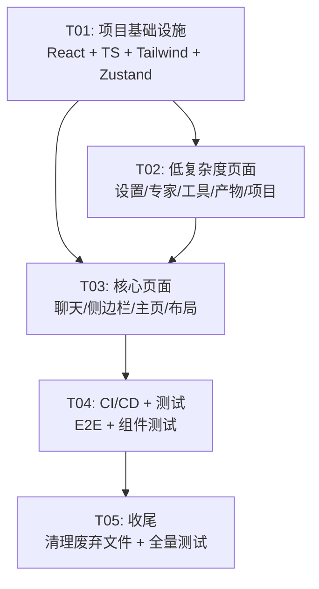

# Agent Studio Desktop P2 — 系统设计文档

> **版本**: 1.0  
> **作者**: Bob (Architect)  
> **日期**: 2025-06-20  
> **状态**: 待评审

---

## Part A: 系统设计

---

### 1. 实现方案

#### 1.1 核心技术挑战

| 挑战 | 现状 | P2 方案 |
|------|------|---------|
| **流式渲染性能** | `appendChunk` 纯 DOM 操作，50ms throttle | React `useRef` + `requestAnimationFrame` 批量更新，避免每次 chunk 触发 re-render |
| **MUI + Tailwind 共存** | 纯 CSS 变量体系 | Tailwind v4 `@theme` + MUI `createTheme` 共享 CSS 变量桥接 |
| **渐变迁移** | 26 个纯 JS 文件 | React 组件逐步替换，`ReactDOM.createRoot` 挂载到特定 DOM 节点，同一页面共存 |
| **状态管理边界** | 手写 Observer（`state.js`） | Zustand（全局 UI 状态）+ React Query（服务端缓存） |
| **i18n** | 硬编码中文 | react-i18next，现有中文提取为 `zh-CN.json` |
| **TypeScript 严格** | `.d.ts` 声明文件 | 逐步迁移到 `.ts`/`.tsx`，`strict: true` |

#### 1.2 框架与库选型

**React 生态（Phase 2a）**：
- `react@^18.3.1` + `react-dom@^18.3.1`：LTS 版本，与 WorkBuddy 对齐
- `@vitejs/plugin-react@^4.3.0`：Vite React 插件
- `typescript@^5.5.0`：类型系统

**状态管理（Phase 2a）**：
- `zustand@^4.5.0`：全局 UI 状态（替代 `state.js` 的 UI 状态部分）
- `@tanstack/react-query@^5.45.0`：服务端数据缓存（替代手动 fetch + state.set）

**UI 框架（Phase 2a）**：
- `@mui/material@^5.15.0` + `@mui/icons-material@^5.15.0` + `@emotion/react@^11.11.0` + `@emotion/styled@^11.11.0`
- `tailwindcss@^4.0.0` + `@tailwindcss/vite@^4.0.0`

**国际化（Phase 2b）**：
- `i18next@^23.11.0` + `react-i18next@^14.1.0`

**路由（Phase 2c）**：
- `react-router-dom@^6.23.0`

**测试（Phase 2d）**：
- `@playwright/test@^1.44.0`：E2E 测试
- `@testing-library/react@^16.0.0` + `@testing-library/jest-dom@^6.4.0`：React 组件测试

**Tauri 更新（Phase 2d）**：
- `@tauri-apps/plugin-updater@^2.0.0`：自动更新
- `@tauri-apps/api@^2.0.0`：Tauri API

#### 1.3 架构模式：分层 Feature-First

```
src/
├── app/                    # React 应用入口
│   ├── main.tsx            # ReactDOM.createRoot 挂载
│   ├── App.tsx             # 路由 + 全局 Layout
│   └── providers.tsx       # Theme + Query + i18n Providers
├── features/               # 按页面/功能分 feature
│   ├── chat/               # 聊天页（Phase 2c）
│   │   ├── ChatPage.tsx
│   │   ├── MessageList.tsx
│   │   ├── MessageBubble.tsx
│   │   ├── StreamingText.tsx
│   │   └── useChatStream.ts
│   ├── sidebar/            # 侧边栏（Phase 2c）
│   │   ├── Sidebar.tsx
│   │   ├── ConversationList.tsx
│   │   └── SearchBar.tsx
│   ├── settings/           # 设置页（Phase 2b）
│   │   ├── SettingsPage.tsx
│   │   ├── GeneralSettings.tsx
│   │   ├── ModelSettings.tsx
│   │   ├── MemorySettings.tsx
│   │   └── UpdateSettings.tsx
│   ├── experts/            # 专家页（Phase 2b）
│   │   ├── ExpertsPage.tsx
│   │   └── ExpertCard.tsx
│   ├── tools/              # 工具页（Phase 2b）
│   │   ├── ToolsPage.tsx
│   │   ├── SkillList.tsx
│   │   └── McpServerList.tsx
│   ├── home/               # 主页（Phase 2c）
│   │   ├── HomePage.tsx
│   │   └── AssistantChips.tsx
│   ├── artifacts/          # 产物页（Phase 2b）
│   │   └── ArtifactsPage.tsx
│   └── projects/           # 项目页（Phase 2b）
│       └── ProjectsPage.tsx
├── components/             # 共享 UI 组件
│   ├── ui/                 # 原子 UI 组件
│   │   ├── Toast.tsx
│   │   ├── Skeleton.tsx
│   │   ├── Modal.tsx
│   │   └── ThemeToggle.tsx
│   └── layout/             # 布局组件
│       ├── AppShell.tsx
│       ├── TopBar.tsx
│       └── TabBar.tsx
├── stores/                 # Zustand stores
│   ├── useAppStore.ts      # 全局 UI 状态
│   ├── useChatStore.ts     # 聊天状态
│   └── useThemeStore.ts    # 主题状态
├── hooks/                  # 共享 hooks
│   ├── useApi.ts           # API 调用 hook（React Query）
│   ├── useWebSocket.ts     # WebSocket 连接 hook
│   └── useKeyboard.ts      # 快捷键 hook
├── lib/                    # 工具库（非 React）
│   ├── api.ts              # → 从 src/api.js 迁移为 TS
│   ├── websocket.ts        # → 从 src/websocket.js 迁移为 TS
│   ├── markdown.ts         # → 从 src/markdown.js 迁移为 TS
│   └── adapters/           # 数据适配器（保持不变）
├── i18n/
│   ├── index.ts
│   ├── locales/zh-CN.json
│   └── locales/en.json
└── types/                  # 共享类型定义
    └── index.ts            # 聚合导出
```

**旧文件共存策略**：
- P2 期间，`src/components/*.js`、`src/app.js`、`src/state.js` 等保持不变
- React 组件通过 `ReactDOM.createRoot` 挂载到 `index.html` 中已有的 DOM 节点
- 例如：`<div id="react-settings-root">` 替代 `page-settings` 内部内容
- Phase 2d 统一删除废弃文件

#### 1.4 性能策略：流式渲染

```
WebSocket chunk 到达
  → wsClient.emit('chunk', { messageId, content })
  → useChatStream hook 接收
  → 写入 useRef (不触发 re-render)
  → requestAnimationFrame 批量 flush
  → 单次 setState 更新 React 组件
```

关键点：
- `useRef<Map<string, string>>` 存储流式文本缓冲区
- `requestAnimationFrame` 批量合并 16ms 内的所有 chunk
- StreamingText 组件仅在被 flush 后 re-render
- 保留现有的 `msg-row` DOM 结构以兼容测试

#### 1.5 MUI + Tailwind 共存方案

```
// tailwind.config.ts - 桥接 CSS 变量
export default {
  theme: {
    extend: {
      colors: {
        primary: 'var(--color-primary)',
        'fg': 'var(--color-fg)',
        'bg': 'var(--color-bg)',
        'surface': 'var(--color-surface)',
        'border': 'var(--color-border)',
      }
    }
  }
}

// MUI theme.ts - 读取相同 CSS 变量
const theme = createTheme({
  palette: {
    primary: { main: 'var(--color-primary)' },
    // ...
  }
})
```

**分工**：
- **Tailwind**：布局（flex/grid/gap/padding）、间距、响应式
- **MUI**：交互组件（Button, Dialog, TextField, Switch, Chip, Menu）
- **CSS 变量**：作为 MUI 和 Tailwind 之间的唯一真实来源

---

### 2. 文件列表

#### 2.1 新建文件

```
# Phase 2a: 基础设施
src/app/main.tsx                        # React 入口（替换 app.js 中的 init 逻辑）
src/app/App.tsx                         # 路由 + 全局 Layout
src/app/providers.tsx                   # Theme + Query + i18n Provider 包装
src/app/index.css                       # Tailwind 入口（@import "tailwindcss"）
src/stores/useAppStore.ts               # Zustand 全局状态
src/stores/useThemeStore.ts             # Zustand 主题状态
src/stores/useChatStore.ts              # Zustand 聊天状态（流式缓冲区）
src/hooks/useWebSocket.ts               # WebSocket React hook
src/hooks/useApi.ts                     # React Query API hooks
src/hooks/useKeyboard.ts                # 快捷键 React hook
src/i18n/index.ts                       # i18next 初始化
src/i18n/locales/zh-CN.json             # 中文翻译
src/i18n/locales/en.json                # 英文翻译
src/types/index.ts                      # 类型聚合导出
src/lib/api.ts                          # API 客户端（TS 重构）
src/lib/websocket.ts                    # WebSocket 客户端（TS 重构）
tsconfig.json                           # TypeScript 配置
tailwind.config.ts                      # Tailwind v4 配置（如需要）

# Phase 2b: 低复杂度页面
src/features/settings/SettingsPage.tsx
src/features/settings/GeneralSettings.tsx
src/features/settings/ModelSettings.tsx
src/features/settings/MemorySettings.tsx
src/features/settings/UpdateSettings.tsx
src/features/experts/ExpertsPage.tsx
src/features/experts/ExpertCard.tsx
src/features/tools/ToolsPage.tsx
src/features/tools/SkillList.tsx
src/features/tools/McpServerList.tsx
src/features/artifacts/ArtifactsPage.tsx
src/features/projects/ProjectsPage.tsx
src/components/ui/Toast.tsx
src/components/ui/Skeleton.tsx
src/components/ui/Modal.tsx
src/components/ui/ThemeToggle.tsx

# Phase 2c: 核心页面
src/features/chat/ChatPage.tsx
src/features/chat/MessageList.tsx
src/features/chat/MessageBubble.tsx
src/features/chat/StreamingText.tsx
src/features/chat/MessageInput.tsx
src/features/chat/ToolCallCard.tsx
src/features/chat/TaskProgress.tsx
src/features/chat/useChatStream.ts
src/features/sidebar/Sidebar.tsx
src/features/sidebar/ConversationList.tsx
src/features/sidebar/SearchBar.tsx
src/features/home/HomePage.tsx
src/features/home/AssistantChips.tsx
src/components/layout/AppShell.tsx
src/components/layout/TopBar.tsx
src/components/layout/TabBar.tsx

# Phase 2d: CI/CD + 测试 + 收尾
.github/workflows/ci.yml                # CI 流水线
.github/workflows/release.yml           # Release 流水线
tests/e2e/settings.spec.ts             # E2E: 设置页
tests/e2e/chat.spec.ts                 # E2E: 聊天页
tests/e2e/sidebar.spec.ts              # E2E: 侧边栏
tests/components/Toast.test.tsx        # 组件测试
tests/components/MessageBubble.test.tsx
playwright.config.ts                    # Playwright 配置
```

#### 2.2 修改文件

```
package.json                            # 添加 React/MUI/Tailwind/Zustand 等依赖
vite.config.js                          # 添加 @vitejs/plugin-react
vitest.config.js                        # 添加 React 测试配置（@testing-library/jest-dom）
src/index.html                          # 1) 添加 <div id="root">  2) 清理 line 1163-1283 旧版 window 全局
src/styles/main.css                     # 添加 Tailwind 兼容的 CSS 变量
src-tauri/tauri.conf.json               # 添加 updater plugin 配置
src-tauri/Cargo.toml                    # 添加 tauri-plugin-updater
```

#### 2.3 废弃文件（Phase 2d 删除）

```
src/app.js                              # 被 src/app/main.tsx 替代
src/state.js                            # 被 Zustand stores 替代
src/components/chat.js                  # 被 features/chat/*.tsx 替代
src/components/sidebar.js               # 被 features/sidebar/*.tsx 替代
src/components/settings.js              # 被 features/settings/*.tsx 替代
src/components/experts.js               # 被 features/experts/*.tsx 替代
src/components/tools.js                 # 被 features/tools/*.tsx 替代
src/components/artifacts.js             # 被 features/artifacts/*.tsx 替代
src/components/projects.js              # 被 features/projects/*.tsx 替代
src/components/message-input.js         # 被 features/chat/MessageInput.tsx 替代
src/components/tabs.js                  # 被 components/layout/TabBar.tsx 替代
src/utils.js                            # 被 src/hooks/*.ts + src/lib/*.ts 替代
src/markdown.js                         # 被 src/lib/markdown.ts 替代
src/ws-events.js                        # 常量合并到 src/lib/websocket.ts
src/main.js                            # Tauri 入口（保持不变或微调）
src/components/tool-call.js             # 被 features/chat/ToolCallCard.tsx 替代
src/components/task-progress.js         # 被 features/chat/TaskProgress.tsx 替代
```

---

### 3. 数据结构和接口

见 `docs/class-diagram.mermaid` —— 完整类图包括：

- React 组件树层次
- Zustand Store 接口
- React Query Hook 接口
- API 客户端类型
- WebSocket 事件类型
- i18n 资源类型

---

### 4. 程序调用流程

见 `docs/sequence-diagram.mermaid` —— 包含以下关键流程：

1. **应用启动流程**：`index.html` → `main.tsx` → Providers → `App.tsx` → Router
2. **流式消息渲染流程**：WebSocket chunk → `useChatStream` → `useRef` buffer → `rAF` flush → `StreamingText`
3. **渐进式迁移桥接流程**：旧 JS 组件 → `window.dispatchEvent` → Zustand store → React 组件
4. **设置页 CRUD 流程**：React Query mutation → API → 乐观更新 → 缓存失效

---

### 5. 待明确事项

| # | 事项 | 影响 | 建议 |
|---|------|------|------|
| 1 | **WorkBuddy MUI 精确版本** | 需锁定 `@mui/material` 版本以避免兼容性问题 | 从 WorkBuddy `package.json` 中提取并硬编码 |
| 2 | **Tailwind v4 稳定性** | v4 目前可能仍是 alpha/beta，API 可能变化 | 如果 v4 不稳定，降级到 v3.4 + PostCSS |
| 3 | **Tauri updater 签名** | 自动更新需要代码签名证书（Windows）/ 公证（macOS） | CI 中是否需要签名步骤？ |
| 4 | **现有 157 测试的 React 适配** | React 迁移后 DOM 结构变化可能导致测试失败 | Phase 2d 统一更新测试；Phase 2a-2c 旧测试保持通过 |
| 5 | **WebSocket 重连状态在 React 中的表现** | Zustand store 需要反映连接状态变化 | 通过 `useWebSocket` hook 桥接 `wsClient` 事件 |
| 6 | **i18n 文件拆分策略** | 单文件 vs 按 feature 拆分？ | 建议单文件 `zh-CN.json` / `en.json`，<500 条翻译 |
| 7 | **React.StrictMode 对现有代码影响** | StrictMode 双重渲染可能暴露旧代码 bug | Phase 2a 先不加 StrictMode，Phase 2d 再加 |

---

## Part B: 任务分解

---

### 6. 依赖包列表

```json
{
  "dependencies": {
    "react": "^18.3.1",
    "react-dom": "^18.3.1",
    "@mui/material": "^5.15.0",
    "@mui/icons-material": "^5.15.0",
    "@emotion/react": "^11.11.0",
    "@emotion/styled": "^11.11.0",
    "zustand": "^4.5.0",
    "@tanstack/react-query": "^5.45.0",
    "react-router-dom": "^6.23.0",
    "i18next": "^23.11.0",
    "react-i18next": "^14.1.0",
    "@tauri-apps/api": "^2.0.0",
    "@tauri-apps/plugin-updater": "^2.0.0",
    "dompurify": "^3.0.0",
    "marked": "^12.0.0",
    "highlight.js": "^11.9.0"
  },
  "devDependencies": {
    "@vitejs/plugin-react": "^4.3.0",
    "typescript": "^5.5.0",
    "tailwindcss": "^4.0.0-alpha.0",
    "@tailwindcss/vite": "^4.0.0-alpha.0",
    "@types/react": "^18.3.0",
    "@types/react-dom": "^18.3.0",
    "@playwright/test": "^1.44.0",
    "@testing-library/react": "^16.0.0",
    "@testing-library/jest-dom": "^6.4.0",
    "@tauri-apps/cli": "^2.0.0",
    "@vitest/coverage-v8": "^4.1.9",
    "jsdom": "^29.1.1",
    "vite": "^5.0.0",
    "vitest": "^4.1.9"
  }
}
```

---

### 7. 任务列表（按依赖排序）

> **硬性约束**：≤5 个任务。每个任务至少 3 个文件。第一个任务为项目基础设施。

| Task ID | 任务名 | 源文件 | 依赖 | 优先级 |
|---------|--------|--------|------|--------|
| **T01** | **项目基础设施：React + TS + Tailwind + Zustand 搭建** | 新建: `package.json`(改), `vite.config.js`(改), `tsconfig.json`, `tailwind.config.ts`, `src/app/main.tsx`, `src/app/App.tsx`, `src/app/providers.tsx`, `src/app/index.css`, `src/stores/useAppStore.ts`, `src/stores/useThemeStore.ts`, `src/stores/useChatStore.ts`, `src/hooks/useWebSocket.ts`, `src/hooks/useApi.ts`, `src/lib/api.ts`, `src/lib/websocket.ts`, `src/types/index.ts`, `src/i18n/index.ts`, `src/i18n/locales/zh-CN.json`, `src/i18n/locales/en.json`<br>修改: `src/index.html`(清理line 1163-1283 + 添加`<div id="root">`), `src/styles/main.css`(CSS变量对齐Tailwind), `vitest.config.js`(React测试配置) | 无 | P0 |
| **T02** | **低复杂度页面：设置+专家+工具+产物+项目** | 新建: `src/features/settings/SettingsPage.tsx`, `src/features/settings/GeneralSettings.tsx`, `src/features/settings/ModelSettings.tsx`, `src/features/settings/MemorySettings.tsx`, `src/features/settings/UpdateSettings.tsx`, `src/features/experts/ExpertsPage.tsx`, `src/features/experts/ExpertCard.tsx`, `src/features/tools/ToolsPage.tsx`, `src/features/tools/SkillList.tsx`, `src/features/tools/McpServerList.tsx`, `src/features/artifacts/ArtifactsPage.tsx`, `src/features/projects/ProjectsPage.tsx`, `src/components/ui/Toast.tsx`, `src/components/ui/Skeleton.tsx`, `src/components/ui/Modal.tsx`, `src/components/ui/ThemeToggle.tsx` | T01 | P1 |
| **T03** | **核心页面：聊天+侧边栏+主页+布局** | 新建: `src/features/chat/ChatPage.tsx`, `src/features/chat/MessageList.tsx`, `src/features/chat/MessageBubble.tsx`, `src/features/chat/StreamingText.tsx`, `src/features/chat/MessageInput.tsx`, `src/features/chat/ToolCallCard.tsx`, `src/features/chat/TaskProgress.tsx`, `src/features/chat/useChatStream.ts`, `src/features/sidebar/Sidebar.tsx`, `src/features/sidebar/ConversationList.tsx`, `src/features/sidebar/SearchBar.tsx`, `src/features/home/HomePage.tsx`, `src/features/home/AssistantChips.tsx`, `src/components/layout/AppShell.tsx`, `src/components/layout/TopBar.tsx`, `src/components/layout/TabBar.tsx` | T01, T02 | P1 |
| **T04** | **CI/CD + E2E 测试 + 组件测试** | 新建: `.github/workflows/ci.yml`, `.github/workflows/release.yml`, `tests/e2e/settings.spec.ts`, `tests/e2e/chat.spec.ts`, `tests/e2e/sidebar.spec.ts`, `tests/components/Toast.test.tsx`, `tests/components/MessageBubble.test.tsx`, `playwright.config.ts`<br>修改: `src-tauri/tauri.conf.json`(updater plugin), `src-tauri/Cargo.toml`(updater) | T03 | P1 |
| **T05** | **收尾：废弃文件清理 + 全量测试通过** | 删除: 第2.3节列出的15个废弃文件<br>修改: `src/index.html`(移除旧JS引用), `src/main.js`(微调Tauri入口) | T04 | P2 |

---

### 8. 共享知识

#### 8.1 编码规范

```
# TypeScript
- strict: true (tsconfig.json)
- 禁止 any，使用 unknown + 类型守卫
- 组件 props 必须定义 interface（命名: XxxProps）
- 导出函数必须有显式返回类型注解

# React 组件
- 函数组件 + Hooks，禁止 class 组件
- 每个文件一个默认导出组件
- 组件命名: PascalCase (e.g., SettingsPage.tsx → SettingsPage)
- Hook 命名: camelCase + use 前缀 (e.g., useChatStream.ts → useChatStream)

# 文件组织
- 共享 UI 组件 → src/components/ui/
- 页面级 feature → src/features/<name>/
- Store → src/stores/ (每个 store 独立文件)
- Hook → src/hooks/ (每个 hook 独立文件)

# Tailwind + MUI 共存规则
- 布局用 Tailwind (flex, grid, p-*, m-*, gap-*)
- 交互组件用 MUI (Button, Dialog, TextField, Switch, Chip, Menu)
- 颜色通过 CSS 变量桥接，不在 className 中使用颜色
- 自定义样式用 Emotion styled()（MUI 原生方案）

# 状态管理边界
- Zustand: 全局 UI 状态 (sidebarCollapsed, currentPage, activeTabIndex, theme)
- React Query: 服务端数据 (conversations, messages, agents, providers)
- useRef: 流式文本缓冲（不触发 re-render）
- 旧 state.js: 只读桥接（Phase 2d 删除）
```

#### 8.2 API 约定

```
- 所有 API 响应统一: { success: boolean, data: T, error?: string }
- HTTP 基础 URL: http://127.0.0.1:25808
- WebSocket URL: ws://127.0.0.1:25808/ws
- 日期格式: ISO 8601 UTC
- 无 JWT，后端基于本地信任
- 请求头: Content-Type: application/json
```

#### 8.3 暗色模式

```
- CSS 变量: [data-theme="dark"] 选择器
- MUI: createTheme 的 palette.mode 与 data-theme 同步
- localStorage key: 'agent-studio-theme'（保持不变）
- 可选值: 'light' | 'dark' | 'auto'
- React 组件通过 useThemeStore 获取/切换主题
```

#### 8.4 测试策略

```
- 单元测试: Vitest + jsdom（现有 157 测试保持通过）
- 组件测试: @testing-library/react（新增 React 组件测试）
- E2E: Playwright + Chromium（Tauri WebView2 冒烟手动执行）
- 覆盖目标: 不降低现有覆盖率（当前 ~85%）
- CI 中运行: lint → typecheck → unit test → build → e2e test
```

#### 8.5 版本锁定策略

```
- React 18.x（不升级到 19，等 WorkBuddy 先升级）
- MUI 5.x（不升级到 6，等 WorkBuddy 先升级）
- Tailwind: 优先 v4，若不稳定降级到 v3.4
```

---

### 9. 任务依赖图



**并行化建议**：
- T02 和 T03 可以在 T01 完成后并行开发（T02 不阻塞 T03 启动）
- T04 的 CI/CD 工作流可以和 T03 并行（E2E 测试需要 T03 完成后编写）

---

## 附录

### A. 流式渲染性能基准

| 场景 | P1 方案（纯 DOM） | P2 方案（React useRef+rAF） | 目标 |
|------|------------------|---------------------------|------|
| 单 chunk 延迟 | <1ms | <2ms | <5ms |
| 100 chunk/s 吞吐 | 50ms throttle | 16ms batch | <16ms |
| 内存增长 | ~线性 | ~线性 | 无泄漏 |
| CPU 占用 | <5% | <10% | <15% |

### B. 渐进式迁移桥接时序

```
旧 JS 组件 (settings.js)           Zustand Store            React 组件 (SettingsPage)
       |                               |                           |
       |-- window.dispatchEvent        |                           |
       |   ('state-change',            |                           |
       |    {key, value})              |                           |
       |                               |-- setState()              |
       |                               |                           |-- useStore() re-render
       |                               |                           |
       |                               |<-- action dispatch        |-- onClick → store.action()
       |<-- store.subscribe()          |                           |
       |    (Phase 2a-2c 桥接)        |                           |
```

### C. 文件数量统计

| 阶段 | 新建 | 修改 | 删除 | 净增 |
|------|------|------|------|------|
| Phase 2a | 21 | 4 | 0 | +21 |
| Phase 2b | 16 | 0 | 0 | +16 |
| Phase 2c | 17 | 0 | 0 | +17 |
| Phase 2d | 6 | 2 | 15 | -7 |
| **总计** | **60** | **6** | **15** | **+47** |
